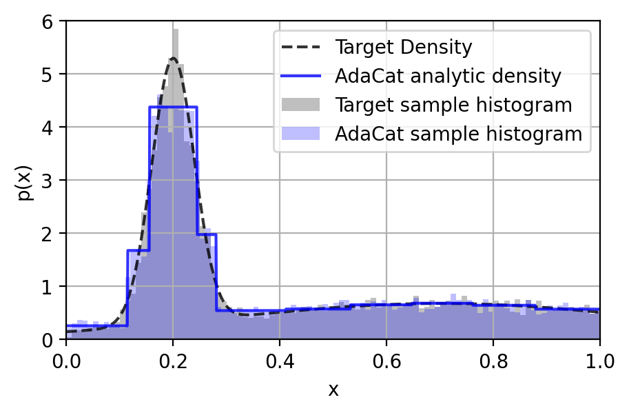

## AdaCat
pip package for adaptive categorical distribution (Adacat) proposed in [ADACAT: Adaptive Categorical Discretization for Autoregressive Models](https://openreview.net/forum?id=HMzzPOLs9l5).

- installation: `pip install adacat`
- see example of usage in `demo.py`/`demo.ipynb`



## Citation
The bibtex is provided below for citation covenience.
```
@inproceedings{
li2022adacat,
title={AdaCat: Adaptive Categorical Discretization for Autoregressive Models},
author={Qiyang Li and Ajay Jain and Pieter Abbeel},
booktitle={The 38th Conference on Uncertainty in Artificial Intelligence},
year={2022},
url={https://openreview.net/forum?id=HMzzPOLs9l5}
}
```
